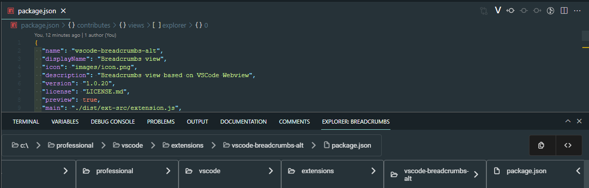

# Breadcrumbs view based on VSCode Webview

This view is like Mac Finder Conlumn View.



# Settings

|Name|Description|Default|
|-|-|-|
|vscode-breadcrumbs-alt.breadcrumbFromWorkspaceRoot|Show breadcrumbs from workspace root.|true|
|vscode-breadcrumbs-alt.showBreadcrumbIcons|Show icons in breadcrumbs.|true
# Features

- Clicking on files opens the file.
- Clicking on folder trims the breadcrumb and shows contents of the folder in the columns on the right. If the folder is in the workspace it is revealed in the Explorer view.

Right clicking on items show context menu of commands:

- Copy Path
- Desktop Terminal
- Explorer
- Terminal (integrated)

The idea is to gather more feedback on this type of UI. Eventually want to support adding commands to the context menus in the breadcrumb view.

Partly addresses:

- [Column-view (Miller columns) for the breadcrumbs #110115](https://github.com/microsoft/vscode/issues/110115)
- [Support context menu on breadcrumb items. #139975](https://github.com/microsoft/vscode/issues/139975)

## Development

This project was generated with `Angular CLI`, so it can be be used for angular development by default.

To test this extension in vscode context:
```
$ yarn install
$ yarn run build
```

After build process you can press F5 to "Start Debugging" (or: select in menu "Debug" -> "Start Debugging"). A new window will open in which you need to open command palette (Ctrl/Cmd + Shift + P).

## Packaging

To generate extension in `VSIX` format execute the package command:

```
yarn run package
```

Finally the generated VSIX file with VSCode extension should appear in the root folder of your project.

# Acknowledgements

Project was inspired by:

https://github.com/4gray/vscode-webview-angular
